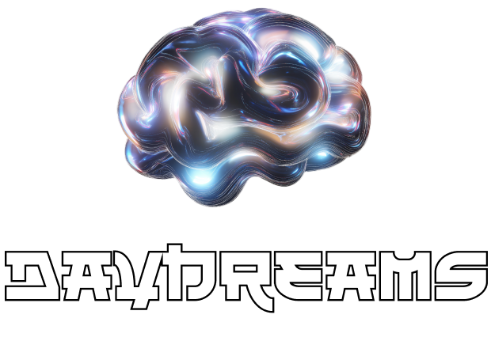

  
  <h1 align="center">Awesome Daydreams</h1>
  

    
    
    
  

  
A curated list of awesome <a href="https://www.dreams.fun/">Daydreams</a> resources, libraries, tools and more.

  
Please check the <a href="CONTRIBUTING.md">contribution guidelines</a> for information on formatting and writing pull requests.

### Contents

- [Resources](#resources)
  - [Official](#official)
  - [Tutorials and Examples](#tutorials-and-examples)
  - [Articles and Blogs](#articles-and-blogs)
  - [Papers](#papers)
- [Ecosystem](#ecosystem)
  - [Dapps](#dapps)
  - [Community](#community)
- [Additional developer resources](#additional-developer-resources)
  - [Developer Tools](#developer-tools)

- [Open-source projects](#open-source-projects)
  - [Defi](#defi)
  - [Gaming](#gaming)

- [License](#license)

## Resources

#### Official
- [Github](https://github.com/daydreamsai/daydreams/tree/main) - Official Github repository.
- [Website](https://www.dreams.fun/) - Official website.
- [Docs](https://docs.dreams.fun/) - Official documentations.
- [Discord](https://discord.com/invite/P8UUNGtHZs) - Official Discord server.
- [Twitter](https://x.com/daydreamsagents) - Official Twitter account.
- [Telegram](https://t.me/+kGzGMRvsQhY5Njg0) - Official Telegram channel.

#### Tutorials and Examples
- [basic-example](https://github.com/daydreamsai/daydreams/blob/main/examples/v0/example-basic.ts) - Basic example demonstrating Daydreams.
- [context-example](https://github.com/daydreamsai/daydreams/blob/main/examples/v0/eternum-context.ts) - Example demonstrating how to give different kind of contexts to your Daydreams Agents.
- [goal-example](https://github.com/daydreamsai/daydreams/blob/main/examples/v0/example-goal.ts) - Example demonstrating goal-based agent functionality with Daydreams.
- [api-example](https://github.com/daydreamsai/daydreams/blob/main/examples/v0/example-api.ts) - Example demonstrating a Twitter bot using Daydreams.
- [server-example](https://github.com/daydreamsai/daydreams/blob/main/examples/v0/example-server.ts) - Example demonstrating how to integrate your Agents with a server.
- [vision-example](https://github.com/daydreamsai/daydreams/blob/main/examples/v0/example-vision.ts) - Example demonstrating a console-based chat interface using Daydreams.
- [hyperliquid-example](https://github.com/daydreamsai/daydreams/blob/main/examples/v0/example-hyperliquid.ts) - Example demonstrating a comprehensive Hyperliquid trading bot using Daydreams.
- [sui-example](https://github.com/daydreamsai/daydreams/blob/main/examples/v0/example-sui.ts) - Example demonstrating Sui interactions using Daydreams.
- [telegram-example](https://github.com/daydreamsai/daydreams/blob/main/examples/v0/example-telegram.ts) - Example demonstrating how to integrate Daydreams with Telegram.
- [twitter-example](https://github.com/daydreamsai/daydreams/blob/main/examples/v0/example-twitter.ts) - Example demonstrating how to integrate Daydreams with Twitter.
- [discord-example](https://github.com/daydreamsai/daydreams/blob/main/examples/v0/example-discord.ts) - Example demonstrating a Discord bot using Daydreams.

#### Video Resources
- Still dreaming...

#### Articles and Blogs
- [Daydreams Deep Dive: A Technical Review of the Next-Gen Onchain Agent](https://dev.to/bruce_f98f32568eeb89017f9/daydreams-deep-dive-a-technical-review-of-the-next-gen-onchain-agent-4o61) - Community Post by [@LowCapLlama](https://x.com/LowCapLlama) 

#### Papers
- Still dreaming...

## Ecosystem

#### Dapps
- Still dreaming...

#### Community
- Still dreaming...

## Additional developer resources

#### Developer Tools
- Still dreaming...

## Open-source projects

#### Defi
- Still dreaming...
#### Gaming
- Still dreaming...
#### Social
- Still dreaming...
---

## License

